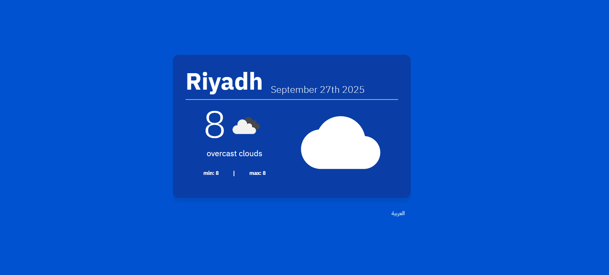
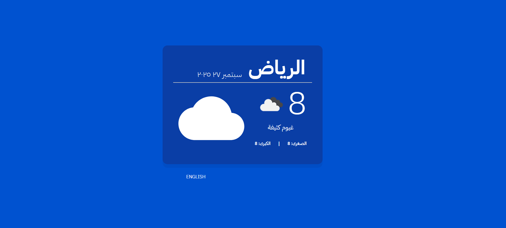

# 🌤️ weather-app

**A responsive and bilingual weather application built with React, Vite, and Material UI.**

🎯 This is my **third official project after completing the React course** 💪  
🚀 From the Udemy course by Eng. **Yarob Al Mostafa** ([Tarmeez Academy](https://www.youtube.com/@tarmeez))

---

## 📖 Project Description

This project is a **Weather App** built using **React + Vite** and styled with **Material UI (MUI)**.  
It fetches real-time weather data from the **OpenWeatherMap API**, displaying the current temperature, min/max values, weather description, and an icon.  

The app supports **bilingual UI (Arabic & English)**, **RTL layout**, and localized **date/time formatting** with Moment.js.

---

## ✅ Features

- 🌡️ Display current temperature with weather description  
- 🌡️ Show minimum and maximum daily temperatures  
- 🌤️ Fetch real-time weather data from OpenWeatherMap API  
- 🖼️ Display weather icons dynamically based on API data  
- 🗓️ Show current date with localization support  
- 🌐 Toggle between **Arabic & English** languages  
- 🔁 Support **RTL** layout for Arabic users  
- 🎨 Custom Material UI theme with **IBM font**  
- 📱 Fully responsive design  

---

## 🧠 React Concepts Used

| Concept                 | Usage                                                 |
| ----------------------- | ----------------------------------------------------- |
| `useState`              | Manage locale, and date/time states                   |
| `useEffect`             | Fetch weather data & update date on component load    |
| `useReducer`            | Centralized state management for weather and UI logic |
| `useTranslation`        | Provide bilingual (Arabic/English) text rendering     |
| `Conditional Rendering` | Dynamically render weather icons and text             |
| `ThemeProvider`         | Apply custom Material UI theme globally               |

---

## 🧰 Tools & Libraries

| Tool                   | Purpose                                                |
| ---------------------- | ------------------------------------------------------ |
| **React**              | Main framework for UI logic                            |
| **Vite**               | Fast development environment and bundler               |
| **Material UI (MUI)**  | UI components, theming, and icons                      |
| **Axios**              | API requests to OpenWeatherMap                         |
| **Moment.js**          | Localized date & time formatting                       |
| **i18next**            | Translation and multilingual support                   |
| **OpenWeatherMap API** | Weather data source                                    |
| **IBM Font**           | Custom typography                                      |
| **useReducer**         | State management hook inspired by `Array.reduce`       |
| **gh-pages**           | Deployment tool for publishing the app on GitHub Pages |

---

## 📸 Screenshots

### 🖥️ Desktop View  

#### 🌐 English Version  
  

#### 🌐 Arabic Version (RTL)  
  

---

## 📝 Notes

- ✅ This project was **completed on September 2025**  
- 🌐 It supports **Arabic & English** with RTL/LTR layouts  
- ☁️ Weather data powered by **OpenWeatherMap API**  
- 🛠️ Now styled with **Material UI** and a custom theme  

---

## 📚 Useful Links

### 🌐 Weather API

- 📘 OpenWeatherMap API:  
  [https://openweathermap.org/api](https://openweathermap.org/api)

### 🎓 Course & Instructor

- 📘 React Course on Udemy:  
  [https://www.udemy.com/course/tarmeezacademy-react/](https://www.udemy.com/course/tarmeezacademy-react/)

- 📺 Tarmeez Academy YouTube Channel:  
  [https://www.youtube.com/@tarmeez](https://www.youtube.com/@tarmeez)

- 👨‍💻 Eng. Yarob Al Mostafa on GitHub:  
  [https://github.com/Yarob50](https://github.com/Yarob50)

---

## 🧑‍💻 Author

**Maher Elmair**

- 📫 [maher.elmair.dev@gmail.com](mailto:maher.elmair.dev@gmail.com)  
- 🔗 [LinkedIn](https://www.linkedin.com/in/maher-elmair)  
- ✖️ [X (Twitter)](https://x.com/Maher_Elmair)  
- ❤️ Made with passion by [Maher Elmair](https://maher-elmair.github.io/My_Website)

---

## 🔗 Live Preview

🎥 **View the project live on GitHub Pages (or other host):**

🌐 [Live Demo](https://maher-elmair.github.io/Weather-App/)

---

## 🙌 Thank You

If you liked the project, please ⭐ the repository!  
Feel free to open issues or contribute with PRs — always appreciated 🙏
